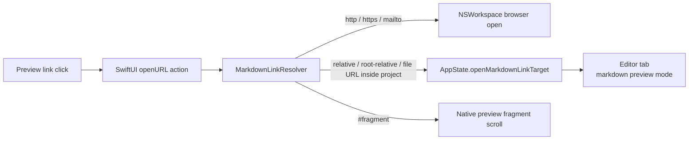

# Markdown Preview

Markdown preview is rendered natively with SwiftUI and MarkdownUI through `NativeMarkdownPreviewView`. The native renderer splits the document into render units with `NativeMarkdownDocumentParser`, renders standard markdown blocks with MarkdownUI, and renders Mermaid fenced code blocks with `NativeMermaidBlockView`.

The old `WKWebView` preview shell, bundled JavaScript markdown renderer, and custom markdown asset scheme handlers are intentionally removed from this implementation.

## Link routing

Internal links are resolved against the current markdown file and constrained to the active project root before opening. Root-relative links such as `/docs/guide.md` resolve from the project root. External browser schemes are handed to `NSWorkspace`.

Heading fragments are handled in the native preview. Render units expose stable anchor IDs and source line ranges, and `NativeMarkdownPreviewView` scrolls same-document fragments locally. Cross-file fragments are stored on `EditorTabState` and applied after the target preview lays out.

## Rendering boundary

The preview no longer loads a local HTML shell or bundled JavaScript renderer. Local images are loaded from disk when their resolved paths stay inside the current project. Remote images are loaded only when `MarkdownPreviewPreferences.allowRemoteImages` is enabled and the URL uses `https`.

Link clicks are classified by `MarkdownLinkResolver` and routed either to `NSWorkspace`, to `AppState`, or to native same-document fragment scrolling.

## Scroll synchronization

Split view scroll synchronization is coordinated by `MarkdownScrollSyncController`. The editor reports source-line geometry, while the native preview reports render-unit anchor geometry and scroll metrics through `MarkdownPreviewScrollReport`. The coordinator maps scroll positions through the available anchors instead of assuming proportional heights, which keeps synchronization stable when rendered markdown contains HTML blocks, Mermaid diagrams, images, or other content whose rendered height differs from its source height.
